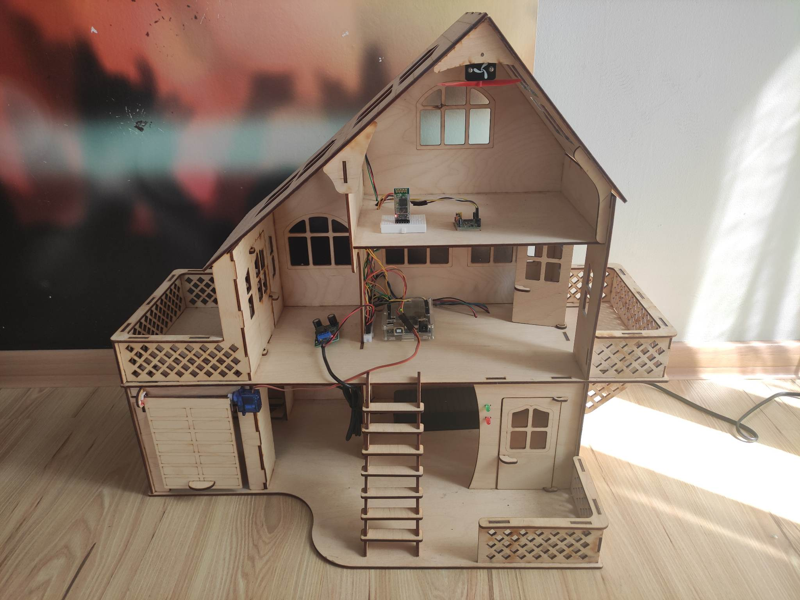
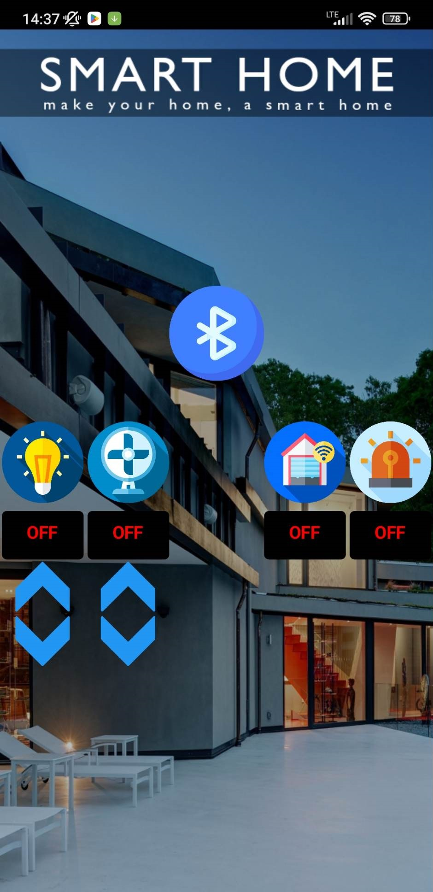
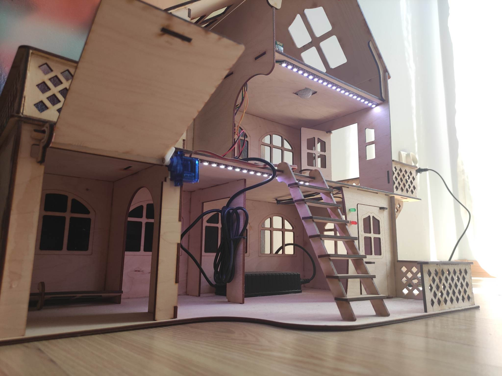
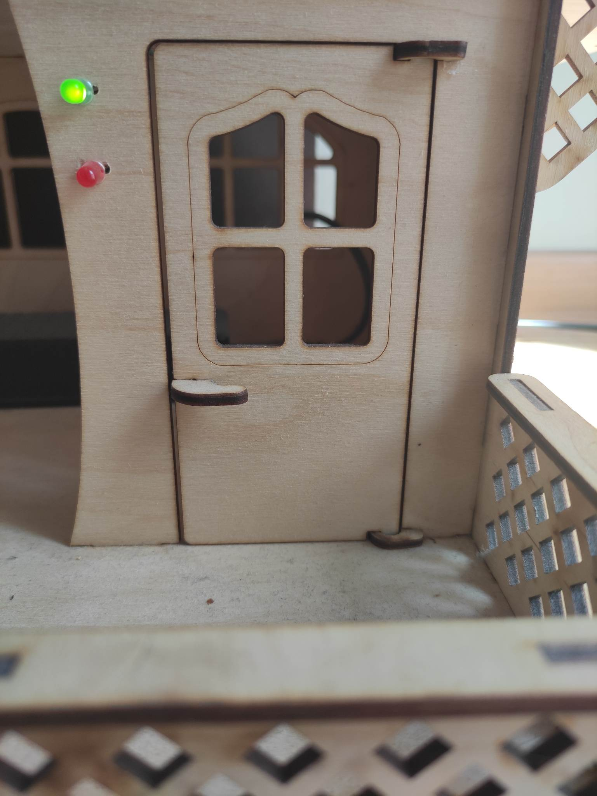
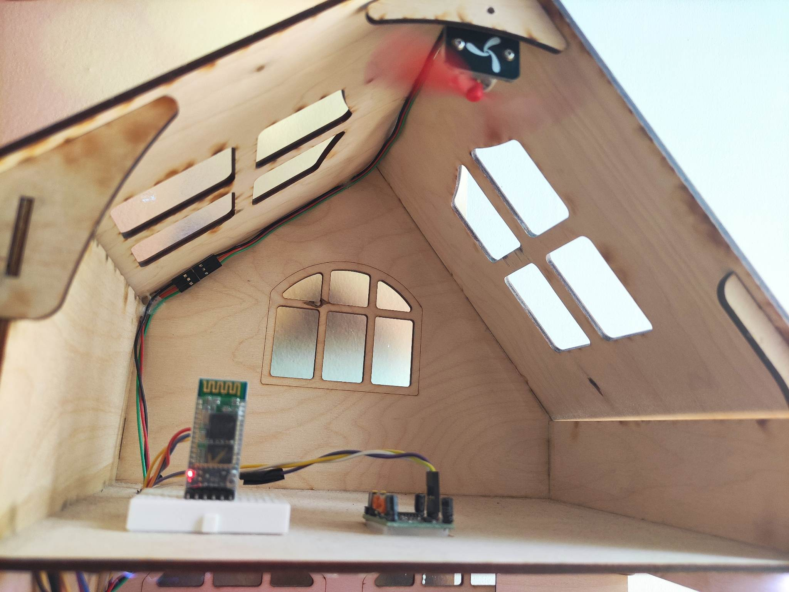
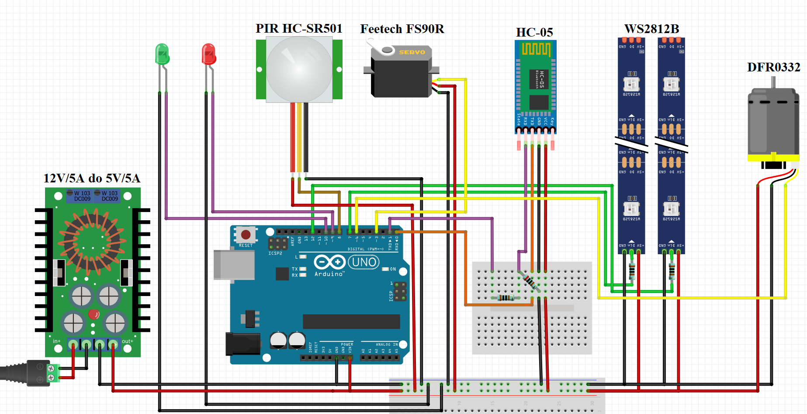

# Smart Home

Home automation implemented using Arduino Uno and available smart solutions. The model aims to showcase the capabilities of a smart home. As part of the functional requirements for the smart building, the following have been specified: 
* lighting with adjustable light intensity,
* a motion sensor with detection signaling,
* ventilation with adjustable speed,
* opening and closing of the garage door,
* control via a mobile application on Android devices.

Construction requirements include:
* building the model of the building,
* connecting electronic system components,
* programming the Arduino Uno using the C++ programming language and the Arduino IDE development environment.

The next stage involved the assembly of components for the intelligent building, constituting a complete system. To achieve this, the following devices were used:

* Arduino Uno - system logic,
* PIR HC-SR501 sensor - building security monitoring,
* Red and green LEDs - motion detection signaling,
* Feetech FS90R servo motor - garage door control,
* Bluetooth HC-05 - communication with a smartphone,
* Addressable WS2812B LED lights - model lighting,
* DFR0332 fan - room ventilation,
* DC-DC step-down converter - voltage reduction for proper system power supply.

The full project description (lang. PL) is located in the <a href="https://github.com/GraczykMateusz/smart-home/blob/master/docs/engineering_thesis.pdf">file</a>.

  
  

-------------------------------

  
  
  

-------------------------------

The system was implemented in accordance with the connection diagram presented below.

